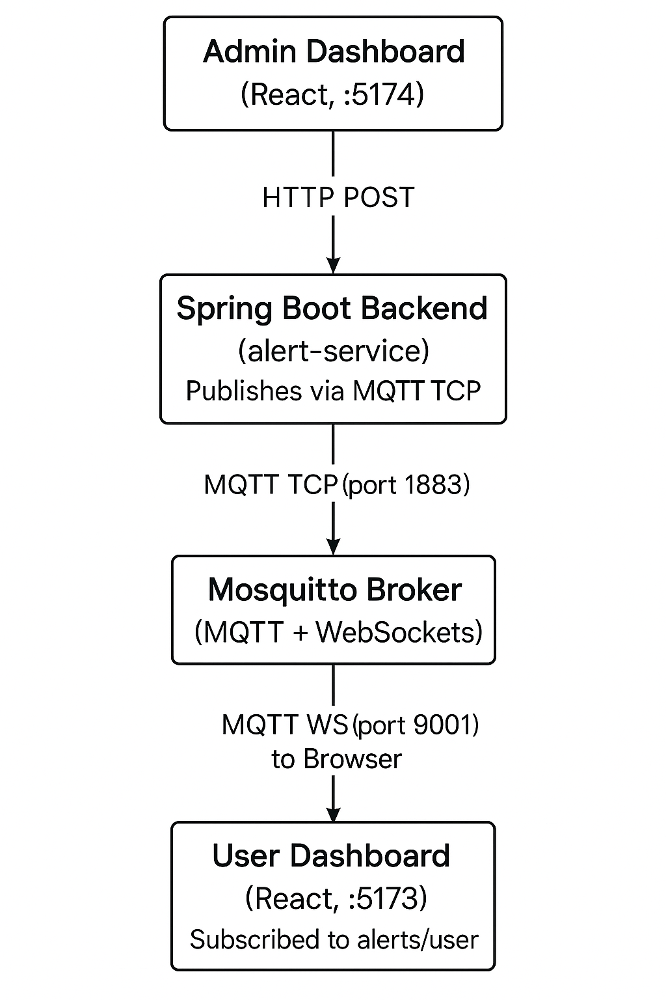

# MQTT-Protocol

## Architecture Diagram

<p align="center">
  
</p>

A **full-stack application** implementing the MQTT protocol for a **real-time, efficient, and light-weight messaging/notification** system.

## Tech Stack

This application is built on -

- A robust **Spring Boot** server
- Minimal **ReactJS** user (client) dashboard
- Minimal **ReactJS** admin dashboard
- Dockerized **PostgreSQL** database
- **MQTT protocol** for pub/sub messaging
- **Docker Compose** for container orchestration

---

## How to run

Follow three simple steps to set up and run the application:

### 1. Clone the repository

```bash
git clone https://github.com/IshrakAdit/mqtt.git
```

Or, you can download the zip and extract the files.

### 2. Move into project directory

### 3. Start the full stack application

Run the following command to build and start all services:

```bash
docker compose up --build -d
```

This command:

- Builds all services
- Starts them in detached mode

**Since this is a tutorial-level repository and users are responsible for their own running instances, all required secrets to run this project are provided in the project files.**

---

## How To Use

### Server

It may take some time (2-3 minutes) for the server to be fully up and running.  
You can check server status by -

**1. Viewing service logs**

```bash
docker compose logs -f alert-service
```

and check for any errors, or,

**2. Testing endpoints**

Test responses for either of the following endpoints -

- `GET http://localhost:8082/user/v1/test`
- `GET http://localhost:8082/notify/v1/test`

---

### User Dashboard

- Open: [http://localhost:5173](http://localhost:5173)
- Register or log in with a username
- You should be redirected to a notification dashboard

---

### Admin Dashboard

- Open: [http://localhost:5174](http://localhost:5174)
- Log in without any credentials (for simplicity)
- Enter the username you used to login/register and send a message
- The message should appear on the respective user's dashboard via MQTT in real-time

---

## How It Works

### Components Overview

| Component               | Role                                                 |
| ----------------------- | ---------------------------------------------------- |
| **Spring Boot Backend** | Publishes alerts (as MQTT messages) to topics        |
| **Mosquitto Broker**    | Routes messages between publishers and subscribers   |
| **React Frontend**      | Subscribes to topics, receives messages in real-time |
| **MQTT JS Client**      | Handles WebSocket connection in the frontend         |
| **MQTT Java Client**    | Publishes messages from backend to broker            |

### End-to-End Flow

1. **User Dashboard** (React):

   - Connects to MQTT broker via WebSocket (`ws://localhost:9001`)
   - Subscribes to specific topic corresponding to username

2. **Admin Dashboard** (React):

   - Sends message via HTTP POST to Spring Boot backend
   - Triggers sending message to specific topic

3. **Spring Boot Backend**:

   - Processes request
   - Publishes message to specific MQTT topic via TCP (1883)

4. **Mosquitto MQTT Broker**:

   - Receives the message on TCP
   - Forwards it to all WebSocket subscribers of the topic

5. **User Dashboard**:
   - Receives message over WebSocket
   - Parses and displays it in real-time (toast + UI update)

No polling or refresh is needed — it’s a push-based, event-driven architecture.

## Forward Strategy

### MQTT vs WebSockets in Frontend

Although the React frontend uses **MQTT over WebSocket** for browser compatibility, MQTT as a protocol remains inherently lightweight and efficient.

### MQTT over WebSocket vs Raw WebSocket

| Feature                 | MQTT over WebSocket                            | Raw WebSocket                                        |
| ----------------------- | ---------------------------------------------- | ---------------------------------------------------- |
| **Communication Model** | Publish-subscribe (pub/sub)                    | Point-to-point (full duplex)                         |
| **Message Overhead**    | Minimal protocol overhead with small headers   | Variable, no built-in message structure              |
| **Scalability**         | Easily supports multiple subscribers per topic | Requires custom logic to manage multiple connections |
| **Reliability**         | Supports QoS levels (0, 1, 2) for delivery     | No native message delivery guarantees                |

### Future Implementation: MQTT over TCP for Mobile

- Next plan is to implement **MQTT over native TCP connections** instead of WebSockets, for mobile applications.
- This allows leveraging MQTT’s full advantages:
  - **Lower network overhead**
  - **Reduced battery consumption**

---

### For any queries, feel free to email me at [ishrak.adit07@gmail.com](mailto:ishrak.adit07@gmail.com) or send a message via [ishrakadit.netlify.app](https://ishrakadit.netlify.app).
